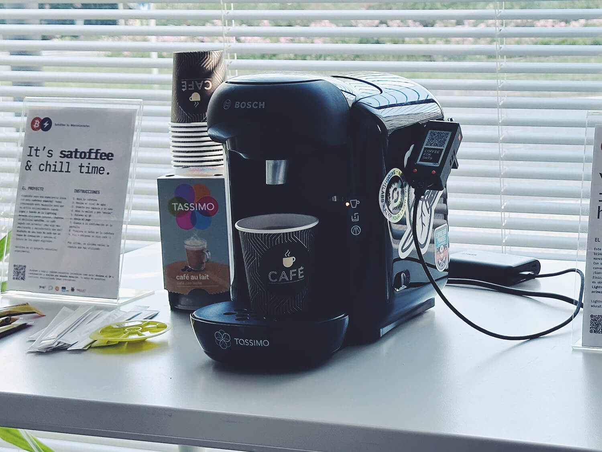

# Satoffee⚡️ (Satoshi + Coffee)

<p align="center"></p>

[👉 Project article (Spanish)](https://danielpcostas.dev/satoffee-lightning-coffee/)

### Install instructions
- Install <a href="https://www.arduino.cc/en/software">Arduino IDE</a>
- Install ESP32 boards, using <a href="https://docs.espressif.com/projects/arduino-esp32/en/latest/installing.html#installing-using-boards-manager">boards manager</a>


- Download this repo
- Copy these <a href="libraries">libraries</a> into your Arduino install "libraries" folder
- Open <a href="satoffee/satoffee.ino">satoffee.ino</a> file in the Arduino IDE
- Change these with your own values
```
String ssid = "your-ssid";
String wifiPassword = "your-wifi-password";
String lnbitsServer = "legend.lnbits.com";
String deviceId = "device-id";
String device_lnurlp = "lightning:LNURL...";
```
- Select the correct ESP32 board from tools>board
- Upload to device

Project based on the [bitcoinswitch](https://github.com/lnbits/bitcoinswitch) from Ben Arc.
